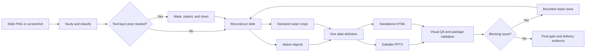

<div align="center">

# pngtopptx

### Reconstruction, not flattening.

**Turn slide screenshots and AI-generated PNGs into editable PowerPoint decks and self-contained HTML — with declared raster regions, font provenance, visual QA, and a final delivery gate.**

[](CHANGELOG.md)
[](DEPENDENCIES.md)
[](DEPENDENCIES.md)
[](#how-it-works)
[](LICENSE)

[View the proof](https://captw.github.io/pngtopptx/examples/generated-cooling-loop/) · [Download the sample PPTX](examples/generated-cooling-loop/editable-reconstruction.pptx) · [Quickstart](QUICKSTART.md) · [Changelog](CHANGELOG.md)

</div>

> **Your AI made the slide. `pngtopptx` makes the handoff editable.**
>
> This toolkit does not paste a screenshot onto a PowerPoint canvas and call it done. It rebuilds titles, panels, tables, labels, icons, callouts, and diagrams as native objects where practical — and explicitly records anything that must remain raster.


## The missing layer in AI slide generation

Image-first slide tools are fast — until someone asks to change one number, translate the copy, replace a logo, restyle the deck, or reuse a diagram.

That is where the handoff breaks.

`pngtopptx` is a **local, agentic slide-reconstruction skillset** built for that gap. It turns slide screenshots or exported PNGs into:

- an editable `.pptx` made from native PowerPoint objects where practical;
- a standalone, self-contained `.html` rendered from the same slide definition;
- explicit crop metadata for regions that cannot honestly be reconstructed as vectors;
- font-resolution, native-object, crop-coverage, render-trace, and QA evidence;
- a repeatable repair loop and a final delivery gate.

Despite the name, this is **not a one-click OCR converter**. It is a production-oriented reconstruction workflow for AI coding agents and presentation engineers who care about what happens after the first beautiful image is generated.

## At a glance

| Dimension | Contract |
|---|---|
| **Input** | Slide screenshots or exported PNGs |
| **Output** | Editable PPTX + self-contained HTML |
| **Best fit** | Dense technical, educational, operational, and infographic slides |
| **Authoring model** | Source-pixel coordinates replayed through one backend-agnostic renderer |
| **Editability policy** | Native objects where practical; declared crops where necessary |
| **Font policy** | Auditable `Original → Resolved` mappings; optional trusted-source preauthorization, never silent resolution |
| **QA policy** | Visual comparison, package validation, reconstruction gates, final gate |
| **Automation model** | One-slide-per-context workers with deterministic central integration |
| **Runtime** | Local, Windows-first, Node.js 20+, Python 3.10+ |

## The trust contract

Most “image to PowerPoint” workflows optimize for a file that opens. `pngtopptx` optimizes for a file that can survive editing, review, and handoff.

### Native when possible

Text, panels, rules, badges, tables, icons, roadmaps, callouts, and diagram primitives are rebuilt as independent objects whenever practical.

### Raster when necessary — and never hidden

Photographs, document facsimiles, complex 3D renders, and other continuous-tone regions may remain images. Those regions are represented as explicit crops with reconstruction reasons and coverage evidence — not disguised as editable output.

### Fonts are provenance, not vibes

The workflow collects original font usage, searches both system-wide and per-user Windows font locations, resolves the exact local font when available, and records every `Original → Resolved` mapping.

A missing font pauses before render. By default it asks for a user decision. A project may instead
preauthorize trusted-source installation with `config/font_install_policy.json`; the external agent
then installs from a verified source or records fallback and continues. The resolver itself never
downloads a font, and every attempt remains auditable.

### QA failures stay visible

The repository keeps strict QA results even when they are inconvenient. Structural editability, package validity, and visual similarity are separate claims, and the toolkit reports them separately.

## What changed in v0.2.x

### v0.2.2 — deterministic PowerPoint text fit and font preauthorization

PowerPoint now replays browser-measured fitted font sizes through a fingerprinted cache instead of
depending on unresolved `shrinkText` metadata. Projects may also preauthorize trusted-source font
installation without repeated prompts while preserving source/hash provenance and fallback.

### v0.2.1 — deterministic per-slide font provenance

Each reconstruction worker now produces a validated per-slide `font_usage.json`. The official integrator merges those artifacts into one deterministic deck-level font manifest before font preflight.

### v0.2.0 — trust and throughput

- Original-font discovery across slide code and usage manifests.
- Windows system and per-user font resolution.
- Auditable `Original → Resolved` mappings in output manifests.
- Explicit user approval or a project-level trusted-source preauthorization before any font-install action.
- On-demand icon manifests instead of regenerating the entire icon library.
- Cache fingerprints for slide assets and QA captures.
- Hash-preserving `--qa-only` validation for unchanged outputs.
- Native-object provenance and reconstruction hardlocks.
- Project guards that prevent production output from leaking into the installed Skill directory.
- Deterministic Codex sub-agent contracts and centralized integration.

See [CHANGELOG.md](CHANGELOG.md) for the compact release history.

## How it works



The central idea is simple: **describe the slide once, render it twice**.

Slide functions use source-pixel coordinates and an abstract drawing surface. The same function is replayed through:

- a PPTX surface backed by `pptxgenjs` and `sharp`; and
- an HTML surface backed by absolutely positioned DOM elements.

The slide code does not branch by output format. PPTX and HTML follow the same reconstruction source of truth.

## Four Skills, one workflow

| Skill | Role |
|---|---|
| [`slide-text-layer-inpaint`](skills/slide-text-layer-inpaint/) | Detect semantic text, pseudo text, microtext, and glyph-like noise; produce masks and clean backgrounds when preprocessing is useful. |
| [`slide-image-dual-render`](skills/slide-image-dual-render/) | Reconstruct editable PPTX and matching HTML; enforce font, crop, route, package, and reconstruction contracts. |
| [`slide-visual-polish-qa`](skills/slide-visual-polish-qa/) | Capture PPTX and HTML renders, compare them with the source, classify issues, and produce actionable fix plans. |
| [`slide-editable-deck-orchestrator`](skills/slide-editable-deck-orchestrator/) | Coordinate end-to-end conversion, bounded repair waves, acceptance levels, and final delivery packaging. |

## Style-aware reconstruction

The renderer ships with frozen style profiles so mixed visual idioms do not force the agent to reinvent the design language on every run.

Included profiles:

- `clinical-dark` — dark gradients, technical panels, cool accents, line icons, chevron roadmaps;
- `corporate-light` — white base, soft cards, navy/orange/teal accents, numbered steps.

The library defines the **grammar**. Per-slide measurement and overrides preserve the **specifics**.

## Quality modes

### Renderer modes

| Mode | Purpose |
|---|---|
| `canary` | One-slide setup smoke test. Fast, approximate, not production. |
| `preservation` | Prioritize visible fidelity while allowing disclosed raster crops. |
| `reconstruction` | Enforce stricter native-object, crop-budget, evidence, QA, and final-gate requirements. |

### Orchestrator acceptance levels

| Level | Acceptance rule |
|---|---|
| `canary` | Verify that the toolchain runs. |
| `blocking-zero` | Production default: no fail/blocking slides; remaining polish items are reported. |
| `polish` | Run additional repair passes to reduce `needs_polish` findings. |
| `strict` | Attempt pass/minor status across the full deck; potentially expensive. |

## Quick install

### Requirements

- Windows PowerShell
- Node.js 20+
- Python 3.10+
- PowerPoint or LibreOffice and Chrome or Edge recommended for full QA

See [DEPENDENCIES.md](DEPENDENCIES.md) for the complete runtime matrix.

### Install the Skillset

```powershell
git clone https://github.com/CAPTW/pngtopptx.git
cd pngtopptx

powershell -ExecutionPolicy Bypass -File .\install.ps1 -BackupExisting -Force
powershell -ExecutionPolicy Bypass -File .\verify_install.ps1
```

Default portable install location:

```text
%USERPROFILE%\.pngtopptx\skills
```

For a Codex-native Skill directory, choose it explicitly and use the same target for installation and verification:

```powershell
$skillRoot = Join-Path $env:USERPROFILE ".codex\skills"

powershell -ExecutionPolicy Bypass -File .\install.ps1 `
  -TargetRoot $skillRoot `
  -BackupExisting `
  -Force

powershell -ExecutionPolicy Bypass -File .\verify_install.ps1 `
  -TargetRoot $skillRoot
```

The toolkit supports both layouts. What matters is that every later command points to the root you actually selected; there is no silent path switching.

### Create a separate deck project

Do not run real conversion jobs inside the installed toolkit directory.

```powershell
mkdir deck
cd deck
mkdir src, assets, work, out, lib
npm i pptxgenjs sharp react react-dom react-icons
```

Copy source images into `src/` as `slide1.png`, `slide2.png`, and so on.

### Use the orchestrator as the entry point

Start with [`slide-editable-deck-orchestrator`](skills/slide-editable-deck-orchestrator/SKILL.md) for an end-to-end job. It coordinates preprocessing, reconstruction, visual QA, repair waves, and final packaging without weakening the individual gates.

For direct renderer commands and environment variables, see the [full workflow](skills/slide-image-dual-render/SKILL.md).

## Fast validation without rebuilding

When outputs and their provenance still match the recorded hashes, rerun only the validation and gate layer:

```powershell
$skillRoot = Join-Path $env:USERPROFILE ".pngtopptx\skills" # or your custom -TargetRoot

node (Join-Path $skillRoot "slide-image-dual-render\scripts\slide_pipeline.js") `
  --project . `
  --slides 1 `
  --quality reconstruction `
  --target both `
  --qa-only
```

`--qa-only` does not blindly trust old files. It verifies the cached inputs, outputs, and evidence fingerprints before reusing them.

## Public proof, including the uncomfortable parts

The [generated cooling-loop example](examples/generated-cooling-loop/) is intentionally dense. It contains a title, four major zones, a process schematic, heatmap, KPI chips, risk table, response playbook, and footer.

What passed:

- hardlocked `slide_pipeline.js` execution;
- `final_gate.js`;
- strict PPTX package validation with 0 errors and 0 warnings;
- 0 crop coverage;
- 659 editable/placed objects recorded in the native-object manifest.

What did **not** pass:

- strict pixel-identical visual QA.

That distinction is deliberate. The example proves editability, package validity, and evidence integrity. It does not pretend that cleaned native reconstruction is identical to distorted AI microtext and ornamental source texture.

[Open the browser report](https://captw.github.io/pngtopptx/examples/generated-cooling-loop/) or [download the editable PPTX](examples/generated-cooling-loop/editable-reconstruction.pptx).

## Best use cases

- AI-generated slides that need a real PowerPoint handoff.
- Technical or educational infographics with dense panels and labels.
- Operational diagrams, process maps, decision trees, and training material.
- Decks that need a browser-readable HTML companion.
- Teams that need evidence of editability, crop usage, font resolution, and QA status.
- Multi-slide reconstruction work that benefits from isolated per-slide agent contexts.

## Not the right tool when

- a flattened screenshot inside a `.pptx` container is acceptable;
- you need a consumer-grade, zero-touch one-click converter;
- the source is mostly photography and editability adds little value;
- you do not have the right to reproduce the source material.

## Repository map

```text
pngtopptx/
├─ skills/
│  ├─ slide-text-layer-inpaint/
│  ├─ slide-image-dual-render/
│  ├─ slide-visual-polish-qa/
│  └─ slide-editable-deck-orchestrator/
├─ examples/
│  └─ generated-cooling-loop/
├─ tests/
├─ install.ps1
├─ verify_install.ps1
├─ package_skillset.ps1
├─ MANIFEST.json
└─ README.md
```

## Validate the toolkit

After editing or packaging the Skillset:

```powershell
powershell -ExecutionPolicy Bypass -File .\verify_install.ps1 -DryRun
node .\tests\verify_skillset_layout.js
python .\tests\verify_python_scripts.py
```

For a rendered deck, also run the hardlocked final gate and strict PPTX package validator documented in [`slide-image-dual-render`](skills/slide-image-dual-render/SKILL.md).

## Local-first by design

The repository intentionally excludes private decks, private source images, local work directories, generated QA captures, `node_modules`, font files, and ad hoc outputs. Curated public validation cases under `examples/` are the exception.

## License

MIT License. See [LICENSE](LICENSE).

The license covers the toolkit source and repository-authored example materials. It does not grant rights to private input decks, third-party slide images, fonts, or other external assets used with the toolkit.

---

<div align="center">

**Built for the part of AI slide generation nobody wants to talk about: the handoff.**

</div>
